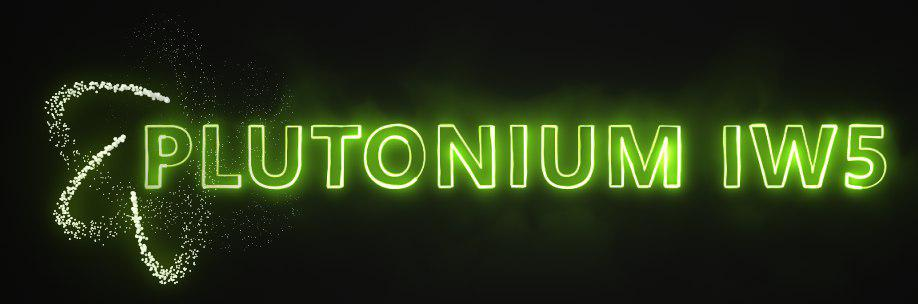

# zonetool
zonetool, a fastfile linker for various Call of Duty titles.

## Folder structure
Call of Duty\
| - zone_source\
| - zonetool\
| - zonetool.exe\
| - zonetool.dll 

## Usage
Simply put the output DLL in your game directory and run zonetool.exe (For IW3, rename the DLL to zoneiw3.dll)

## Commands
``buildzone <zonename>`` - builds the specified zone.\
``loadzone <zonename>`` - loads the specified zone into memory.\
``dumpzone <zonename>`` - dumps all assets from the specified zone.

## Supported asset types
The following asset types can be linked by ZoneTool:

| Asset Type  | IW4 | IW5 |
|-------------|-----|-----|
| PhysPreset  | ✔️    | ✔️    |
| PhysCollmap | ✔️    | ✔️    |
| XAnimParts  | ✔️    | ✔️    |
| XModelSurfs | ✔️    | ✔️    |
| XModel      | ✔️    | ✔️    |
| Material    | ✔️    | ✔️    |
| PixelShader | ✔️    | ✔️    |
| VertexShader | ✔️    | ✔️    |
| VertexDecl  | ✔️    | ✔️    |
| Techset     | ✔️    | ✔️    |
| Image       | ✔️    | ✔️    |
| Sound       | ✔️    | ✔️    |
| SndCurve    | ✔️    | ✔️    |
| LoadedSound | ✔️    | ✔️    |
| CollisionMap | ✔️    | ✔️    |
| ComMap      | ✔️    | ✔️    |
| GlassMap    | ✔️    | ✔️    |
| MapEnts     | ✔️    | ✔️    |
| FxMap       | ✔️    | ✔️    |
| GfxMap      | ✔️    | ✔️    |
| Font        | ✔️    | ✔️    |
| MenuFile    | ❌    | ❌    |
| Menu        | ❌    | ❌    |
| Localize    | ✔️    | ✔️    |
| Attachment  |  -  | ✔️    |
| Weapon      | ✔️    | ✔️    |
| FxEffectDef | ✔️    | ✔️    |
| ImpactFx    | ❌    | ❌    |
| RawFile     | ✔️    | ✔️    |
| ScriptFile  |  -  | ✔️    |
| StringTable | ✔️    | ✔️    |
| LeaderBoardDef | ✔️    | ✔️    |
| StructuredDataDef | ✔️    | ✔️    |
| Tracer      | ✔️    | ✔️    |
| Vehicle     | ❌    | ❌    |
| AddonMapEnts | ❌    | ❌    |

## Supported assets for cross-engine porting
The following asset types can be ported across different games:

| Asset Type  | Supported? |
|-------------|------------|
| PhysPreset  | ✔️    |
| PhysCollmap | ✔️    |
| XAnimParts  | ✔️    |
| XModelSurfs | ✔️    |
| XModel      | ✔️    |
| Material    | ✔️    |
| PixelShader | ✔️    |
| VertexShader | ✔️    |
| VertexDecl  | ✔️    |
| Techset     | ✔️    |
| Image       | ✔️    |
| Sound       | ✔️    |
| SndCurve    | ✔️    |
| LoadedSound | ✔️    |
| CollisionMap | ✔️    |
| ComMap      | ✔️    |
| GlassMap    | ✔️    |
| MapEnts     | ✔️    |
| FxMap       | ✔️    |
| GfxMap      | ✔️    |
| Font        | ❌    |
| MenuFile    | ❌    |
| Menu        | ❌    |
| Localize    | ✔️    |
| Attachment  | ✔️    |
| Weapon      | ✔️    |
| FxEffectDef | ✔️    |
| ImpactFx    | ❌    |
| RawFile     | ✔️    |
| ScriptFile  | ✔️    |
| StringTable | ✔️    |
| LeaderBoardDef | ❌    |
| StructuredDataDef | ✔️    |
| Tracer      | ✔️    |
| Vehicle     | ❌    |
| AddonMapEnts | ❌    |

## Supported clients
ZoneTool generated fastfiles are compatible with the following clients:
* IW4x (IW4 client)
* Plutonium (IW5 client)
* Oxygen (IW5 client)

## Credits
Special thanks to the following people:
* Laupetin
* NTAuthority
* momo5502
* TheApadayo
* localhost
* X3RX35
* homura
* Sofika

## Donate
If you like my work, feel free to contribute!

bitcoin: 17YZtqKcFP4WiwMRZB5AE57QR4oa3fnFAM\
eth: 0xf4f73463861eD8Ba72ac422B237c53B720c6608A

